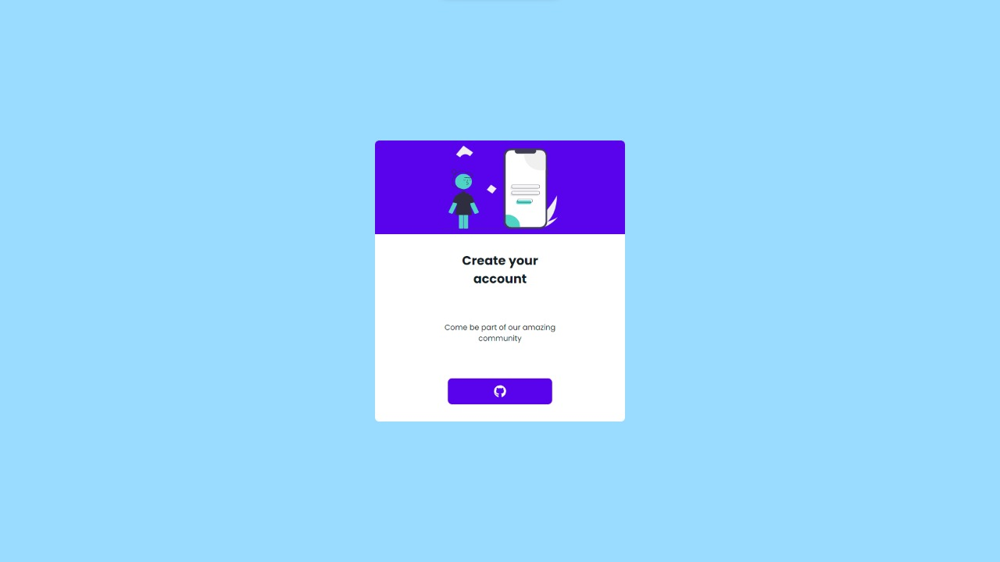

<h1 align="center">
  <strong>Github-login</strong>
</h1>
<br>

## Sobre o projeto - About the project

Este app utiliza utiliza o NextAuth para fazer um simples sistema de login com o GitHub.

This app uses NextAuth to make a simple GitHub login system.


<h1 align="center" display="flex">
   
</h1>

## :computer: Tecnologias - Technologies 

Este projeto foi desenvolvido com as seguintes tecnologias:
<br>
This project was developed with the following technologies:

- [Next](https://nextjs.org/)
- [TypeScript](https://www.typescriptlang.org/)
- [Styled-components](https://styled-components.com/)
- [NextAuth](https://next-auth.js.org/)
  <br>

## Como executar - How to execute
Para iniciá-lo, siga as etapas abaixo:
<br>
To start it, follow the steps below:

```bash
# Instale as dependencias
# Install dependencies
$ yarn

# Inicie o projeto
# start the project
$ yarn start
```
O aplicativo estará disponível em seu navegador no endereço http://localhost:3000.
<br>
The app will be available in your browser at the address http://localhost:3000.

<br>
